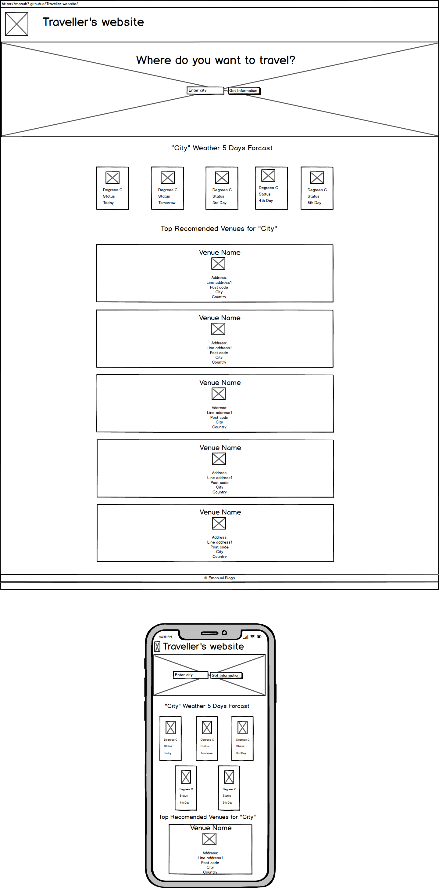

# Traveller website

This is a milestone project for the Interactive Frontend module with Code Institute representing a website destined for travelers wanting to find instant 
information about a particular location. The  information will include top 5 venues  and the 5 days weather forcast, all presented in a 
friendly UX process where all information is displayed on cards at the click of a button. 
 
## UX
 
The UX process was designed with simplicity and minimalism in mind where at the start of the process you get only a suggestive photo with a input text box that has a placeholder suggesting what the input
should be and  next  to it there is a button that indicates clearly what it will do.

Once the button clicked the information appears in form of a cards starting first with the 5 days weather forcast and continuing with the top 5 venue recomandation for that specific location. 
The weather cards are aranged horizontaly in a row and  shows information about the temperature in degrees Celsius, an icon to describe the weather status, one word description and the day in letters full length.
The venue cards are arrange vertically in a column on the center of the screen and displays infomration about the venue name , icon  and the address in full with street name, post code , city and country. 

All wireframes were executed with Balsamiq and can be seen here below. 

## Features

The website has an input text box that querys the specific API for data based on their input 
### Existing Features
- Feature 1 - Allows user to get information about a specific location weather and top 5 recomended value by typing a desired city location in the text box and clicking the "Get Information" button
### Features Left to Implement
- Another feature idea I have is along side with the venue information to have specific venue photos presented. I did spend some time on this feature trying to implement it but due to the need of more 
time to reasearch I have decided it is best to implement at a later date.

## Technologies Used

I have used the following technologies :

- [JQuery](https://jquery.com)
    - The project uses **JQuery** to simplify DOM manipulation.
- [RESTful API's](https://searchapparchitecture.techtarget.com/definition/RESTful-API#:~:text=A%20RESTful%20API%20is%20an,deleting%20of%20operations%20concerning%20resources.)
    - The project uses RESTful API  for an application program interface (API) that uses the HTTP requests to access and use data through "GET", "PUT","POST" methods.
- [HTML](https://www.w3schools.com/html/html_intro.asp)
    - The project uses as the standard markup language for creating Web pages
- [CSS](https://www.w3.org/Style/CSS/Overview.en.html)
    - The project uses Cascading Style Sheets (CSS) is a simple mechanism for adding style (e.g., fonts, colors, spacing) to Web documents
- [Bootstrap](https://getbootstrap.com/)
    - The project uses Boostrap to help deliver quick and responsive mobile-first websites

## Testing

The website was manualy tested with Chrome Developer Tool in a Test Driven Development approach on difrerent screen size as well on other browsers such as Edge and Firefox.

The text input form testing procedure:
1. Input form:
    1. Go to the "Home" page
    2. Try to submit the empty form and verify that an error message about the required fields appears
    3. Try to submit the form with an invalid city name  and verify that a relevant error message appears
    4. Try to submit the form with all inputs valid and verify that all the fileds and information card are displayed properly.

I have spent a lot of time trying to fix the event handler bubbling issue, the event handler was launching and displaying briefly the API information only to dispear in a few milisecconds.
I spend some time researching this issue and found it to be relatate to the syntheticEvent propagating itself in the bubble. 
The  documentation that helped me fix the issue can be found [here](https://reactjs.org/docs/events.html#mouse-events) 
and [here](https://stackoverflow.com/questions/4384829/jquery-onclick-capture-the-id-of-the-element/39629863)

## Deployment

This site is hosted using GitHub pages, deployed directly from the master branch. The deployed site will update automatically upon new commits to the master branch. In order for the site to deploy correctly on GitHub pages, the landing page must be named index.html.

To run locally, you can clone this repository directly into the editor of your choice by pasting git clone https://github.com/manub7/Traveller-website into your terminal. To cut ties with this GitHub repository, type git remote rm origin into the terminal.

## Credits and Acknowledgements

Handle mouse click event trigger with JavaScript [Mouse click event trigger](https://reactjs.org/docs/events.html#mouse-events) 
How to capture item id [Capture id of and element](https://stackoverflow.com/questions/4384829/jquery-onclick-capture-the-id-of-the-element/39629863)
Convert Unix timestamp into string[Display unix timestamp in string format ](https://developer.mozilla.org/en-US/docs/Web/JavaScript/Reference/Global_Objects/Date/toLocaleString)
How to remove sensitive data from Git [Remove sensitive data ](https://docs.github.com/en/free-pro-team@latest/github/authenticating-to-github/removing-sensitive-data-from-a-repository)
The photo is provided by Pexels and you can find the link [here](https://www.pexels.com/photo/airplane-wing-towards-clouds-731217/)
This website uses the Foursqure Places API to retrive data about the venues. You can find the link [here](https://developer.foursquare.com/docs/places-api/) 
This website uses the Open weather API to retrive data about the weather forcast. You can find the link [here](https://openweathermap.org/forecast5)
On how to get current data with JQuery, the link can be found [here](https://stackoverflow.com/questions/8398897/how-to-get-current-date-in-jquery)

### Media
The photo is provided by Pexels and you can find the link [here](https://www.pexels.com/photo/airplane-wing-towards-clouds-731217/)

